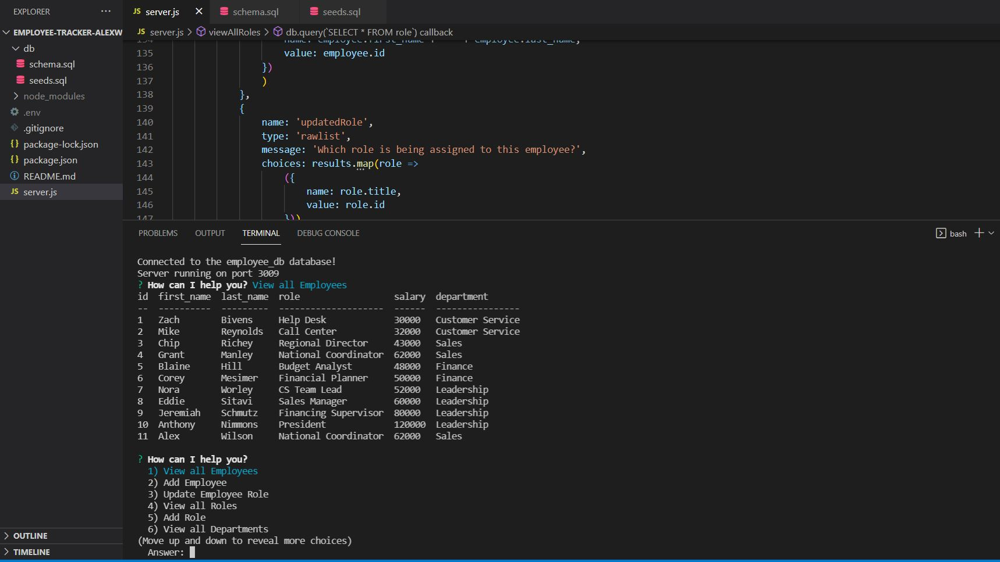

# Employee Tracker (alexw)
HW - 12 SQL: Employee Tracker

## Description
Command-line application that manages a company's employee database, using Node.js, Inquirer, and MySQL.

## Links
- [Github Repository](https://github.com/AlexWilsonNC/employee-tracker-alexw)
- [Linked Video: Walkthrough](https://drive.google.com/file/d/1Qkf3IK2ls68mF_IkzUWDDqFWOcocnSjY/view?usp=sharing)

## Screenshot
